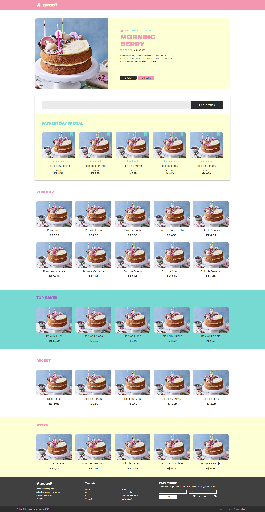

# The Cake website

> Design: https://www.behance.net/gallery/81832669/Cake-Free-Adobe-XD-UI-Kit

This is a really simple project that show the usage of Next.js with TypeScript and Styled Components.

## Deploy your own

Deploy the example using [Vercel](https://vercel.com):

## Demo

Link: https://cake-web.vercel.app/

